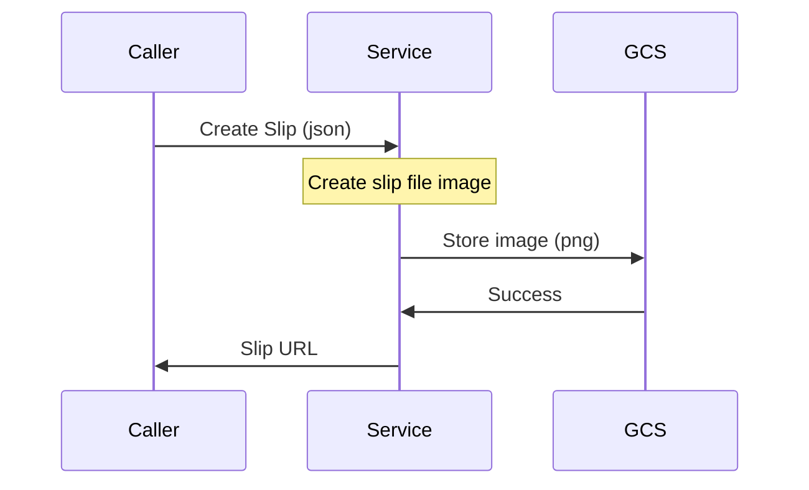

# go-slip

Service for e-slip generator in golang. MIT license.

# Purpose

This project use to reduce slip paper for any POS or web application and let's customer or user choose to get an e-receipt via scan on-screen QR code or shortlink URL. So customer will redirect to service web and display or download slip file in PNG format for any purpose.

## How it's work.

Mobile Client or Caller service make a RESTful API call for NewSlip() function and service return a Shorten-URL link for client to use for download or display a file



# How to test.

1. Create Google Cloud Storage - new Bucket such as "paybox_slip" as you see in "/slip/repository/gcs_test.go"

1. Create your Google Cloud - Service Account and place in "$HOME/secret/" as paybox_slip.json then just run...

```bash
go test -v .
```

or to test just some package.

```bash
go test -v ./slip/repository
```